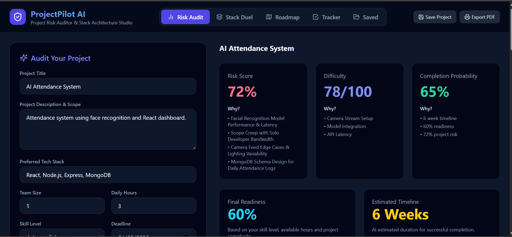
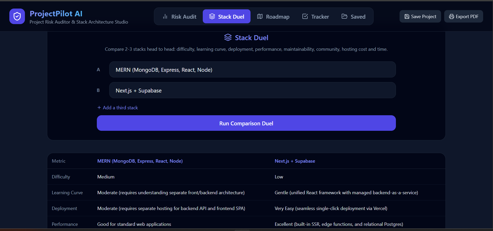
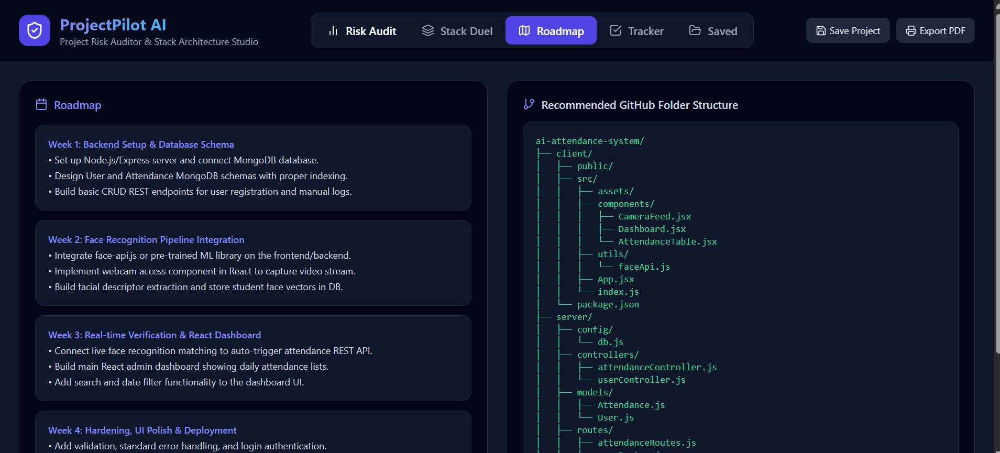
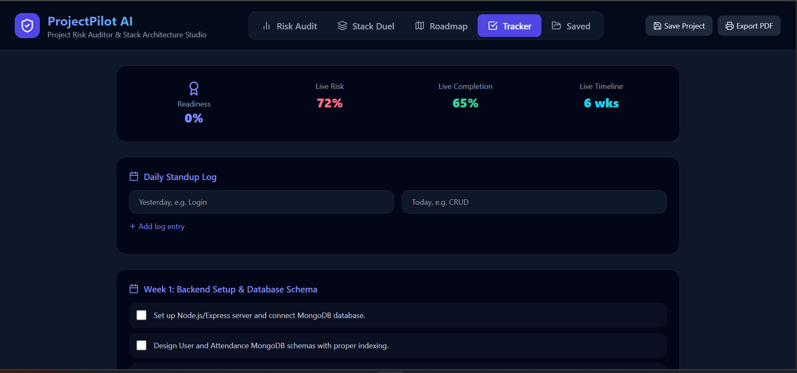

# 🚀 ProjectPilot AI

**AI-Powered Project Risk Auditor & Development Planner**

ProjectPilot AI is a web application that helps students and beginner developers evaluate software projects before they start building them. By analyzing project details such as the description, technology stack, team size, skill level, available working hours, and deadline, the application generates an AI-powered audit report to help users plan projects more effectively and avoid common development mistakes.

---

# 🌍 Live Demo

**Live Application:**  
[https://project-pilot-ai-five.vercel.app/](https://project-pilot-ai-five.vercel.app/)

**GitHub Repository:**  
[[https://github.com/YOUR_USERNAME/projectpilot-ai](https://github.com/NoorUlAin-00/ProjectPilot-AI)](https://github.com/NoorUlAin-00/ProjectPilot-AI)

---

# 📌 Problem Solved

Many students begin software projects without properly estimating their difficulty, identifying technical risks, or planning development. This often results in unrealistic timelines, missing features, poor project structure, and rushed deployments.

ProjectPilot AI assists users by providing an intelligent project audit before development begins, enabling better planning and informed technical decisions.

**Target Users**
- University students
- Beginner software developers
- Academic project teams
- Freelancers planning new projects

---

# ✨ Features

- AI-powered project audit based on user input.
- Calculates:
  - Risk Score
  - Difficulty Score
  - Completion Probability
  - Readiness Score
  - Estimated Development Time
- Explains project risks with High, Medium, and Low severity levels.
- Predicts common failure modes for similar projects.
- Detects missing software engineering requirements.
- Generates mitigation recommendations for identified risks.
- Suggests suitable technology stacks.
- Compares multiple technology stacks.
- Generates a personalized weekly development roadmap.
- Creates a recommended GitHub folder structure.
- Provides testing and deployment checklists.
- Includes a progress tracker for project tasks.
- Exports audit reports as PDF.
- Saves previous project audits using LocalStorage.

---

# 🤖 AI Feature

ProjectPilot AI integrates Google's Gemini API to perform structured project analysis.

The AI evaluates:

- Project scope
- Preferred technology stack
- Team size
- Skill level
- Daily available hours
- Deadline

Instead of generating free-form text, the AI returns structured JSON that is used to build the audit report, including scores, risk analysis, failure modes, missing requirements, mitigation plans, technology recommendations, GitHub structure, and weekly milestones.

### System Prompt

```
You are a Senior Software Architect and Risk Auditor evaluating a university software project.

Analyze the provided project details and return a structured JSON object containing project difficulty, completion probability, readiness score, estimated timeline, risk analysis, failure modes, missing software engineering requirements, mitigation plans, technology recommendations, GitHub folder structure, and weekly milestones.

Return only valid JSON tailored to the provided project.
```

---

# 🛠 Technologies Used

### Frontend
- React
- Vite
- Tailwind CSS

### AI
- Google Gemini API

### UI
- Lucide React Icons

### Storage
- Browser LocalStorage

### Deployment
- Vercel

### Version Control
- GitHub

---

# 📷 Screenshots

Add at least three screenshots here.

# 📷 Screenshots

## Home



## Stack Comparison


## Weekly Roadmap


## Progress Tracker


## Technology Advisor


---

# ⚙️ Running Locally

## Clone the repository

```bash
git clone https://github.com/YOUR_USERNAME/projectpilot-ai.git
```

## Navigate into the project

```bash
cd projectpilot-ai
```

## Install dependencies

```bash
npm install
```

## Create a `.env` file

```env
VITE_GEMINI_API_KEY=YOUR_GEMINI_API_KEY
```

## Start the development server

```bash
npm run dev
```

Open:

```
http://localhost:5173
```

---

# 📄 License

This project was developed as an individual university coursework submission for educational purposes.
